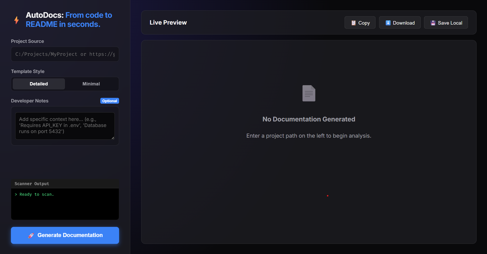

# AutoDocs – From Code to README in Seconds

[](https://github.com/FawazMulla/AutoDocs-From-code-to-README-in-seconds./stargazers)  
[](https://github.com/FawazMulla/AutoDocs-From-code-to-README-in-seconds./network/members)  


---

## 📝 Description
**AutoDocs – From Code to README in Seconds** is a lightweight micro-tool built for **Kiro Week 1 – Micro-Tools Challenge**. It automatically scans a project repository and generates a clean, structured **README file** with project details such as tech stack, architecture, installation steps, API endpoints, environment variables, and project health. This tool eliminates the manual effort of writing documentation and helps developers create professional READMEs instantly.

---

## ✨ Core Functionality
- Automatically scans any local or GitHub repository  
- Detects **programming languages and frameworks**  
- Extracts **API endpoints and environment variables**  
- Generates a complete **README.md automatically**  
- Displays project **architecture and flow diagrams**  
- Analyzes **project health** (tests, CI, linting, file count)  
- Supports **micro-services / .kiro structure**  

---

## 📸 Screenshot



---

## 📑 Table of Contents
- [Tech Stack](#-tech-stack)
- [Core Functionality](#-core-functionality)
- [Architecture](#-architecture)
- [Project Structure](#-project-structure)
- [Installation](#-installation)
- [Usage](#-usage)
- [API Endpoints](#-api-endpoints)
- [Environment Variables](#-environment-variables)
- [Services](#-services)
- [Dependencies](#-dependencies)
- [Project Health](#-project-health)
- [Contributing](#-contributing)
- [Next Steps](#-next-steps)
- [License](#-license)

---

## 🛠 Tech Stack
- **Backend Framework:** Flask  
- **Languages:** Python, JavaScript  
- **Tools:** GitPython, Requests  

---

## 🏗 Architecture
### Component Architecture
```mermaid
graph TD
    User --> UI
    UI --> app
    app --> Logic_Layer
    Logic_Layer --> DeepScanner
````

### Application Flow

```mermaid
sequenceDiagram
    participant User
    participant System
    User->>System: Upload/Enter Repo Path
    System->>System: Scan Repository
    System-->>User: Generate README
```

---

## 📂 Project Structure

```text
.
│   app.py
│   core.py
│
├── .kiro/
│   ├── specs/
│   │   ├── readme-generator/
│   │   │   ├── design.md
│   │   │   ├── requirements.md
│   │   │   ├── tasks.md
│
├── static/
│   ├── script.js
│   ├── style.css
│   ├── favicon.svg
│
├── templates/
│   ├── index.html
|
├── screenshots/
    ├── home.png
    ├── ss1.png
    ├── ss2.png
|
├── test/
    ├── testfiles*

```

---

## ⚙️ Installation

1. **Clone the repository**

   ```bash
   git clone https://github.com/FawazMulla/AutoDocs-From-code-to-README-in-seconds.
   cd AutoDocs-From-code-to-README-in-seconds.
   ```

2. **Python Setup**

   ```bash
   python -m venv venv
   source venv/bin/activate
   pip install -r requirements.txt
   ```

---

## 🚀 Usage

**Run the application:**

```bash
python app.py
```

Open your browser and access:

```
http://localhost:5000
```

Enter a **GitHub repository link or local project path**, and AutoDocs will generate a full README automatically.

---

## 📡 API Endpoints (Auto-detected)

* `POST /generate` – Generate README
* `POST /save` – Save README
* `GET /path` – Load project path
* `POST /path` – Submit project path


---

## 🔐 Environment Variables

Configure the following environment variables (optional):

```bash
VAR=python/scripts
```

---

## 🧩 Services / Packages (Detected)

### `.kiro/`

* Used for design specs and structured planning

### `static/`

* Frontend scripting

### `templates/`

* HTML templates for UI rendering

---

## 📦 Dependencies

**Python**

* Flask
* GitPython
* Requests
* Shutil
* Stat
* Tempfile

---

## 📊 Project Health Snapshot

* **Total Code Files:** 3

  * Python: 2
  * JavaScript: 1
* **Test Files:** 14
* **CI/CD Config:** Not detected
* **Linting/Formatting:** Not detected

---

## 🤝 Contributing

1. Fork the project
2. Create your feature branch
3. Commit your changes
4. Push to the branch
5. Open a pull request

---


## 📄 License

This project is currently **Unlicensed**.

```

